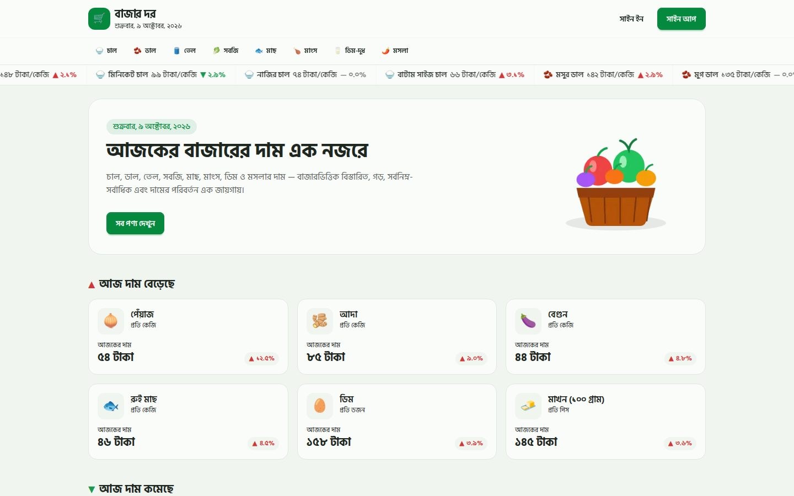
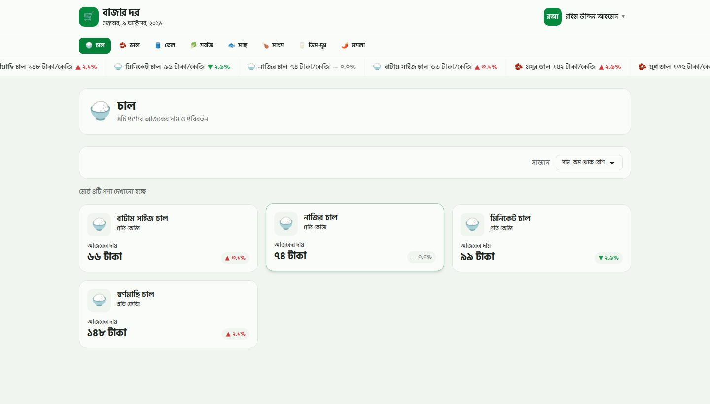
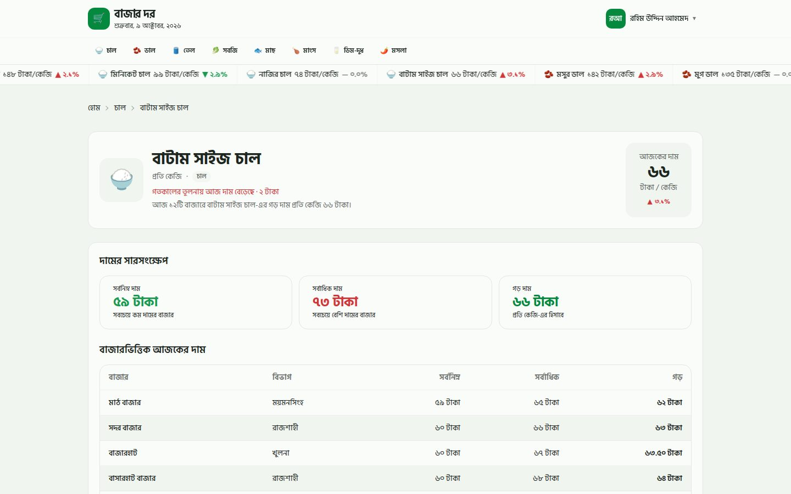
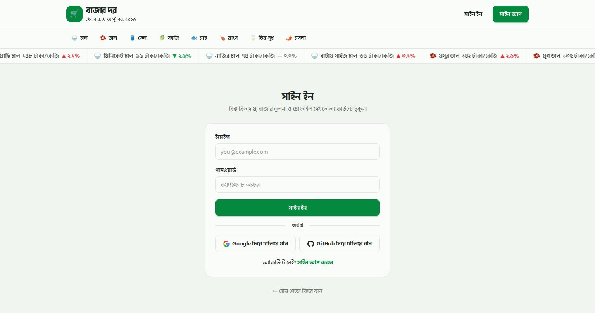
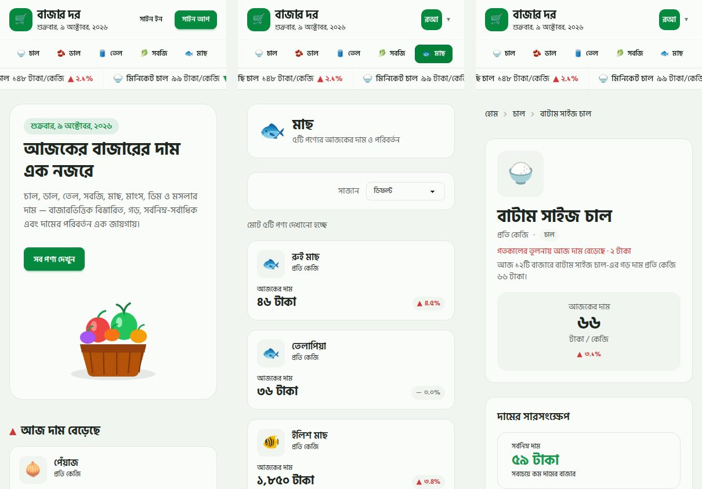

<div align="center">

# 🛒 বাজার দর · BazarDor

**আজকের নিত্যপ্রয়োজনীয় পণ্যের বাজারদর — এক নজরে।**<br />
A daily grocery-price tracker for Bangladesh: today's prices, ▲/▼ changes, category pages and market-by-market tables.

[Live demo](https://assignment-7-radh1.vercel.app) 



</div>

---

## 📖 About

**বাজার দর** shows what rice, pulses, oil, vegetables, fish, meat, eggs/milk and spices cost today, how much each price moved since yesterday, and what every market charges. Anyone can browse prices; signing in unlocks the detailed market-by-market view and a personal profile.

It was built for **Programming Hero · Web Development Batch 14 · Assignment 07** and follows the supplied Figma/Penpot design (kept in [`/design`](./design)) screen by screen: Home, Category, Product Details, Sign In, Sign Up, Profile and the open user menu.

## ✨ Key features

| | Feature | Details |
|---|---|---|
| 📈 | **Live price ticker** | An endless marquee under the navbar: `emoji · name · price/unit · ▲/▼ %`. Pauses on hover and respects *reduced motion*. |
| 🏠 | **Home dashboard** | Hero with a smooth-scroll CTA to `#সব-পণ্য`, the **6 biggest risers**, the **6 biggest fallers** and the full product grid. |
| 🗂️ | **Category pages** | Active category chip in the navbar, skeleton loaders, a **sort control** (default / price low→high / price high→low) and a friendly empty state. |
| 🔐 | **Protected product details** | Min / max / average price cards and a zebra-striped **market-wise price table**. Signed-out visitors are sent to *Sign In* and brought straight back afterwards. |
| 👤 | **Authentication** | [Better Auth](https://www.better-auth.com): email + password, **Google** and **GitHub** login, inline validation and toast feedback on every success / error. |
| ✏️ | **Profile & update** | Avatar, name, e-mail, sign-out, and a separate `/profile/update` route that changes the display name with `updateUser`. |
| 📱 | **Fully responsive** | 1 → 2 → 3 column grids, a scrollable category row, stacked hero, horizontally scrollable table — from phones to wide desktops. |
| 🛟 | **Resilient & polished** | 404 page, error boundaries, two API hosts with automatic fallback, Bengali-digit aware number parsing, accessible markup (labels, `aria-*`, focus rings). |

<details>
<summary><b>More screenshots</b></summary>

| Category + sorting | Product details (signed in) |
|---|---|
|  |  |

| Sign in | Mobile |
|---|---|
|  |  |

*Screenshots use the bundled sample data.*

</details>

## 🧰 Tech stack

| Area | Tools |
|---|---|
| Framework | **Next.js 16** (App Router, React Server Components, streaming + `loading.tsx` skeletons), **React 19**, **TypeScript** |
| Styling | **Tailwind CSS v4** + **DaisyUI 5** with a custom `bazardor` theme taken from the Figma palette · **Hind Siliguri** font (self-hosted via Fontsource) |
| Auth | **Better Auth** (email/password, Google, GitHub) with the **MongoDB** adapter |
| Feedback | **react-hot-toast** |
| Data | Public Bazar Dor JSON API (`/products`, `/products/:id`, `/categories`) |
| Quality | `tsc --noEmit` and Node's built-in test runner (unit tests for the data adapter, formatters and sorting) |

## 🚀 Getting started

**Requirements:** Node.js **20.9+** (22 LTS recommended) and npm.

```bash
# 1. install
npm install

# 2. configure
cp .env.example .env.local      # then fill in the values (see below)

# 3. run
npm run dev                     # http://localhost:3000
# If MongoDB Atlas SRV DNS lookup fails on Windows, use this instead:
# npm run dev:dns
```

> **No database yet?** Leave `MONGODB_URI` empty. In development the app falls back to a temporary in-memory user store (accounts vanish when the server restarts) so you can click through everything straight away.

### Environment variables

| Variable | Required | Purpose |
|---|---|---|
| `BETTER_AUTH_SECRET` | **yes** (production) | Random string used to sign sessions — `openssl rand -base64 32` |
| `BETTER_AUTH_URL` | **yes** (production) | Full absolute URL, e.g. `https://your-project.vercel.app` (include `https://`; no quotes or angle brackets) |
| `MONGODB_URI` | **yes** (production) | MongoDB connection string (Atlas free tier is fine) |
| `MONGODB_DB_NAME` | no | Database name, defaults to `bazardor` |
| `GOOGLE_CLIENT_ID` / `GOOGLE_CLIENT_SECRET` | for Google login | OAuth credentials from the Google Cloud console |
| `GITHUB_CLIENT_ID` / `GITHUB_CLIENT_SECRET` | for GitHub login | OAuth App credentials from GitHub |
| `API_BASE_URL` | no | Comma-separated API base URLs; defaults to the two public Bazar Dor endpoints |

**OAuth redirect URLs** (add both the local and the deployed one):

| Provider | Callback URL |
|---|---|
| Google | `http://localhost:3000/api/auth/callback/google` · `https://<your-domain>/api/auth/callback/google` |
| GitHub | `http://localhost:3000/api/auth/callback/github` · `https://<your-domain>/api/auth/callback/github` |

If a provider's keys are missing, its button still renders and shows a friendly "not configured" toast when clicked.

### Scripts

| Command | What it does |
|---|---|
| `npm run dev` | Start the dev server |
| `npm run build` / `npm start` | Production build / serve it |
| `npm run typecheck` | TypeScript check |
| `npm test` | Unit tests for the data adapter, formatters and sorting (Node 22+) |
| `npm run check:api` | Calls the live API and prints how every product is understood by the app — run this first if prices ever show `—` |
| `npm run mock:api` | Local stand-in API with sample data (`API_BASE_URL=http://127.0.0.1:4010/api/bazardor npm run dev`) |

## 🧼 Starting fresh with a new GitHub repository

This project ZIP is prepared without the previous `.git` history so you can publish it as a new repository.

1. Extract the ZIP into a new folder and open that folder in VS Code.
2. Copy `.env.example` to `.env.local`; use `BETTER_AUTH_URL=http://localhost:3000` locally and add your own MongoDB URI and a private random `BETTER_AUTH_SECRET`.
3. Run `npm install`, then `npm run dev` and test the app at `http://localhost:3000`.
4. Create a **new empty repository** on your GitHub account. Do not initialize it with a README or `.gitignore`.
5. In the project folder, run:

   ```powershell
   git init
   git add .
   git commit -m "Initial Bazar Dor project"
   git branch -M main
   git remote add origin https://github.com/YOUR_GITHUB_USERNAME/YOUR_NEW_REPOSITORY.git
   git push -u origin main
   ```

6. Import that new repository at `https://vercel.com/new` and create a new Vercel project.
7. Add `BETTER_AUTH_SECRET`, `BETTER_AUTH_URL`, `MONGODB_URI`, and `MONGODB_DB_NAME` in Vercel. Set `BETTER_AUTH_URL` to the new Vercel domain with `https://`, then deploy again after saving environment variables.

Never commit `.env.local` or paste your secrets into GitHub. The `.gitignore` in this ZIP excludes local environment files and build output.

## ☁️ Deploying to Vercel

1. Push the project to GitHub and **Import** it on [vercel.com/new](https://vercel.com/new) (framework preset: *Next.js*).
2. Create a free **MongoDB Atlas** cluster → *Database Access*: add a user → *Network Access*: allow `0.0.0.0/0` (Vercel's IPs change) → copy the connection string.
3. In **Project → Settings → Environment Variables** add `BETTER_AUTH_SECRET`, `BETTER_AUTH_URL`, `MONGODB_URI` and, for social login, the Google / GitHub keys. Set `BETTER_AUTH_URL` to the exact production domain with `https://` (for example `https://your-project.vercel.app`), then redeploy. Never set the production value to `localhost` or include placeholder brackets.
4. Add the production callback URLs from the table above to your Google / GitHub OAuth apps.
5. Deploy. Every dynamic route (`/category/[slug]`, `/product/[slug]`, …) is rendered on the server, so reloading any page works without a 404.

Forgot `MONGODB_URI` or `BETTER_AUTH_SECRET`? On Vercel / Netlify / Cloudflare Pages the build stops with a clear message instead of deploying a sign-in that silently forgets users. Invalid auth URLs now produce a clear configuration error; a missing scheme is normalized when possible, and Vercel deployment URLs can be used as a fallback.

## 🗺️ Project structure

```text
src/
├─ app/
│  ├─ page.tsx                  Home (hero + price sections, streamed behind a skeleton)
│  ├─ category/[slug]/          Category page, loading skeleton
│  ├─ product/[slug]/           Protected product details, loading skeleton
│  ├─ signin/  signup/          Auth pages
│  ├─ profile/  profile/update/ Profile and "update name" route
│  ├─ api/auth/[...all]/        Better Auth handler
│  ├─ not-found.tsx  error.tsx  404 and error boundary
│  └─ globals.css               DaisyUI theme (Figma colours), marquee, skeleton tweaks
├─ components/
│  ├─ layout/                   Header, AuthMenu, CategoryNav, PriceTicker, Footer
│  ├─ products/                 Hero, ProductCard, grids, skeletons, product-details parts
│  ├─ auth/                     Sign-in / sign-up / profile forms, social buttons
│  └─ ui/                       Avatar, EmptyState, TodayDate, toast provider …
└─ lib/
   ├─ api.ts                    Fetching with two-host fallback
   ├─ normalize.ts              Turns API JSON (even Bengali-digit strings) into typed data
   ├─ format.ts  sort.ts        Bengali number / date formatting, numeric sorting
   └─ auth.ts  auth-client.ts   Better Auth server + browser client
design/                         Figma (.fig) and Penpot (.penpot) source files
scripts/                        check-api.mjs, mock-api.mjs
tests/                          Unit tests + sample fixtures
```

## 🎨 Design notes

* Colours, radii and spacing come straight from the Figma file: page `#f0f5f0`, surface `#fafcfa`, border `#e1e8e1`, text `#1d271f`, brand green `#05893e`.
* Price movement follows the **Figma**: a price **rise ▲ is red** and a **fall ▼ is green** (good news for shoppers), flat is grey. The brief's text mentions the opposite colours; to flip them change the three values in `TONE` inside [`src/lib/format.ts`](./src/lib/format.ts).
* Prices, percentages and dates are rendered in Bengali digits (`১,৮৫০ টাকা`, `২.১%`, `মঙ্গলবার, ৬ অক্টোবর, ২০২৬`), while sorting and statistics always use real numbers.

## ✅ Assignment checklist

<details>
<summary>Where each requirement lives</summary>

| Requirement | Where |
|---|---|
| Navbar: logo + Bangla date, category links (active highlight), auth buttons / avatar menu, price ticker | `components/layout/*` |
| Hero with CTA anchor `#সব-পণ্য` | `components/products/Hero.tsx` |
| Price movers (6 ▲, 6 ▼) and "সব পণ্য" with count | `components/products/ProductSections.tsx` |
| Product card + badge (▲ / ▼ / —) | `ProductCard.tsx`, `PriceBadge.tsx` |
| Product details (protected, summary, market table) | `app/product/[slug]`, `ProductDetails.tsx` |
| Category page, skeleton, empty state | `app/category/[slug]`, `Skeletons.tsx`, `EmptyState.tsx` |
| Better Auth: email + Google + GitHub, toasts, redirects | `lib/auth.ts`, `components/auth/*` |
| 404 page and `react-hot-toast` for auth and protected-route redirects | `app/not-found.tsx`, `SignInForm.tsx` |
| **C1** sort by price (Bengali numerals handled numerically) | `lib/sort.ts`, `CategoryProducts.tsx` |
| **C2** README | this file |
| **C3** update profile name on its own route | `app/profile/update`, `ProfileUpdateForm.tsx` |

</details>

---

<div align="center">
Made with ❤️ in Bangladesh · Programming Hero Batch 14 · Assignment 07
</div>


### Local MongoDB Atlas DNS workaround

The Better Auth configuration sets Node.js DNS servers to Cloudflare and Google DNS before the MongoDB client is initialized, to work around local `querySrv ECONNREFUSED` errors for Atlas SRV connection strings. Run the app normally with `npm run dev`. If DNS errors persist, check that your network permits DNS queries and verify your Atlas URI and IP access list.
